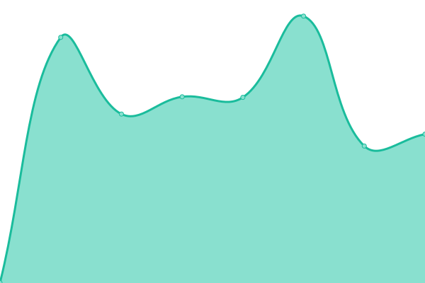
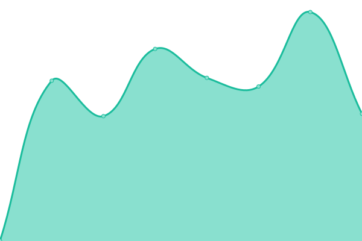
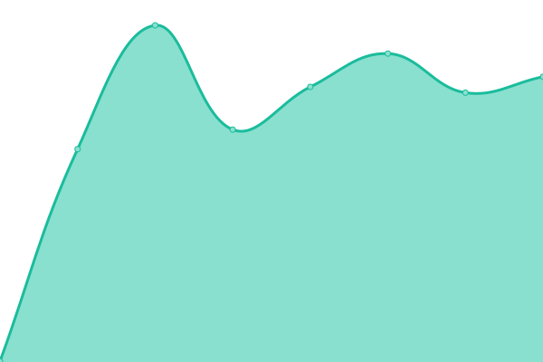
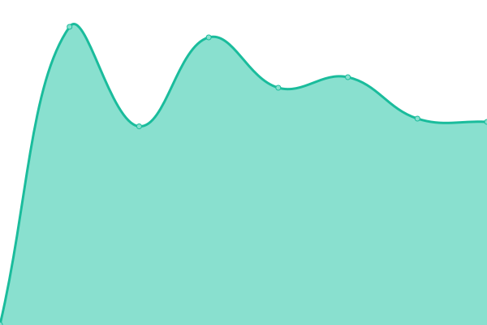
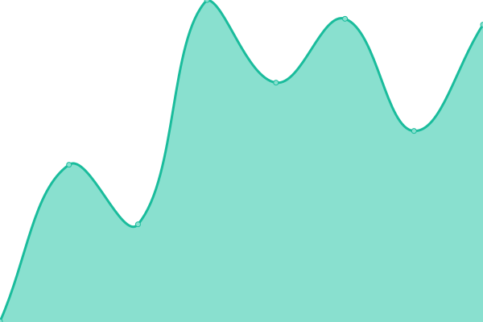
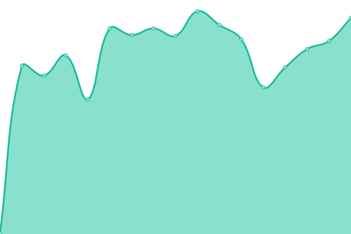
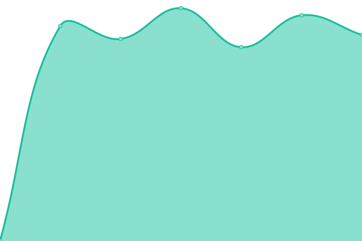

# [📈 Live Status](https://runtime.jerryyang.link): <!--live status--> **🟩 All systems operational**

This repository contains the open-source uptime monitor and status page for [小忧忧](https://www.jerryyang.link), powered by [Upptime](https://github.com/upptime/upptime).

With [Upptime](https://upptime.js.org), you can get your own unlimited and free uptime monitor and status page, powered entirely by a GitHub repository. We use [Issues](https://github.com/jerryyang-git/Site-operation-detection/issues) as incident reports, [Actions](https://github.com/jerryyang-git/Site-operation-detection/actions) as uptime monitors, and [Pages](https://runtime.jerryyang.link) for the status page.

<!--start: status pages-->
<!-- This summary is generated by Upptime (https://github.com/upptime/upptime) -->
<!-- Do not edit this manually, your changes will be overwritten -->
<!-- prettier-ignore -->
| URL | Status | History | Response Time | Uptime |
| --- | ------ | ------- | ------------- | ------ |
|  [👋小忧忧のBlog](https://www.jerryyang.link) | 🟩 Up | [blog.yml](https://github.com/jerryyang-git/Site-operation-detection/commits/HEAD/history/blog.yml) | 

 1053ms
     
 | 

<a href="https://runtime.jerryyang.link/history/blog">100.00%</a>
    

|  [GalZY 紫缘社](https://galzy.eu.org) | 🟩 Up | [gal-zy.yml](https://github.com/jerryyang-git/Site-operation-detection/commits/HEAD/history/gal-zy.yml) | 

 883ms
     
 | 

<a href="https://runtime.jerryyang.link/history/gal-zy">100.00%</a>
    

|  [ImgIO 图床](https://imgio.jerryyang.link) | 🟩 Up | [img-io.yml](https://github.com/jerryyang-git/Site-operation-detection/commits/HEAD/history/img-io.yml) | 

 1021ms
     
 | 

<a href="https://runtime.jerryyang.link/history/img-io">100.00%</a>
    

|  [ImgIoUrl 图床外链域](https://img.jerryyang.link/2023/07/08/4.webp) | 🟩 Up | [img-io-url.yml](https://github.com/jerryyang-git/Site-operation-detection/commits/HEAD/history/img-io-url.yml) | 

 479ms
     
 | 

<a href="https://runtime.jerryyang.link/history/img-io-url">100.00%</a>
    

|  [meowfacts 猫知识 API](https://meowfacts.jerryyang.link) | 🟩 Up | [meowfacts-api.yml](https://github.com/jerryyang-git/Site-operation-detection/commits/HEAD/history/meowfacts-api.yml) | 

 696ms
     
 | 

<a href="https://runtime.jerryyang.link/history/meowfacts-api">100.00%</a>
    

|  [XZH 的博客](https://blog.xzh.gs) | 🟩 Up | [xzh.yml](https://github.com/jerryyang-git/Site-operation-detection/commits/HEAD/history/xzh.yml) | 

 1724ms
     
 | 

<a href="https://runtime.jerryyang.link/history/xzh">100.00%</a>
    

|  [chirmyram 七米蓝](https://www.chirmyram.top) | 🟩 Up | [chirmyram.yml](https://github.com/jerryyang-git/Site-operation-detection/commits/HEAD/history/chirmyram.yml) | 

 610ms
     
 | 

<a href="https://runtime.jerryyang.link/history/chirmyram">97.45%</a>
    

|  [MoeShin](https://moeshin.com) | 🟩 Up | [moe-shin.yml](https://github.com/jerryyang-git/Site-operation-detection/commits/HEAD/history/moe-shin.yml) | 

 950ms
     
 | 

<a href="https://runtime.jerryyang.link/history/moe-shin">100.00%</a>
    

<!--end: status pages-->

[**Visit our status website →**](https://runtime.jerryyang.link)

## 📄 License

- Powered by: [Upptime](https://github.com/upptime/upptime)
- Code: [MIT](./LICENSE) © [小忧忧](https://www.jerryyang.link)
- Data in the `./history` directory: [Open Database License](https://opendatacommons.org/licenses/odbl/1-0/)
