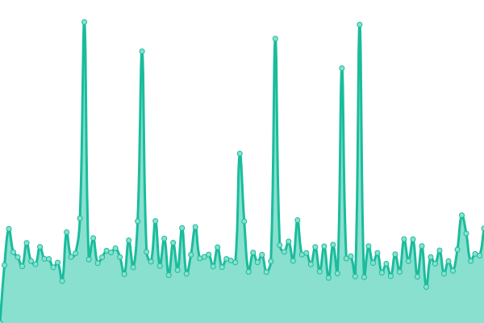
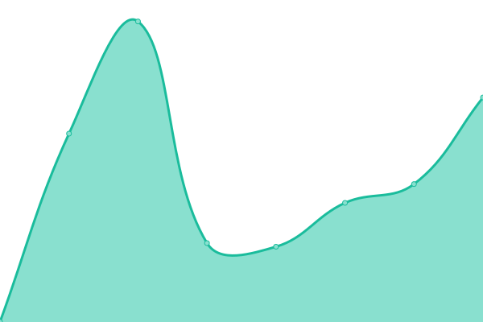
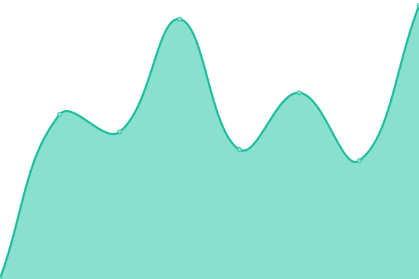
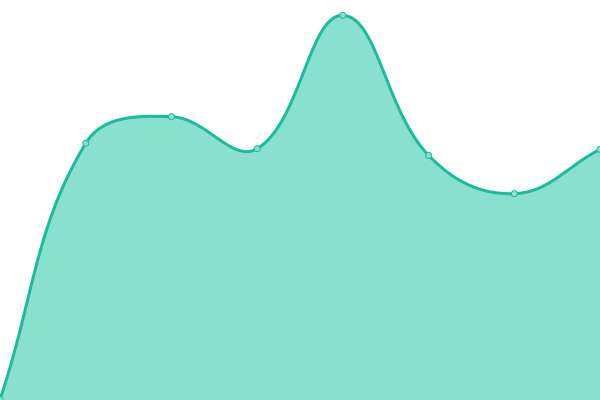
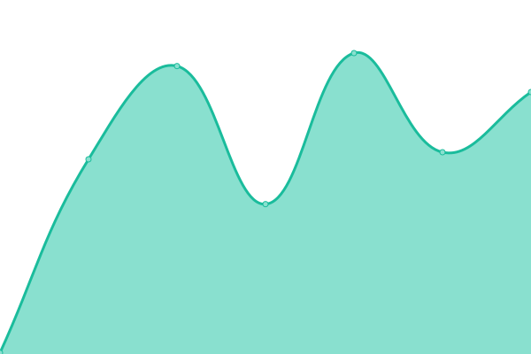

# 

This repository contains the open-source uptime monitor and status page for [小忧忧](https://www.jerryyang.link), powered by [Upptime](https://github.com/upptime/upptime).

With [Upptime](https://upptime.js.org), you can get your own unlimited and free uptime monitor and status page, powered entirely by a GitHub repository. We use [Issues](https://github.com/jerryyang-git/Site-operation-detection/issues) as incident reports, [Actions](https://github.com/jerryyang-git/Site-operation-detection/actions) as uptime monitors, and [Pages](https://runtime.jerryyang.link) for the status page.

<!--start: status pages-->
<!-- This summary is generated by Upptime (https://github.com/upptime/upptime) -->
<!-- Do not edit this manually, your changes will be overwritten -->
<!-- prettier-ignore -->
| URL | Status | History | Response Time | Uptime |
| --- | ------ | ------- | ------------- | ------ |
|  [👋小忧忧のBlog](https://www.jerryyang.link) | 🟩 Up | [blog.yml](https://github.com/youyou-sudo/Site-operation-detection/commits/HEAD/history/blog.yml) | 

 1704ms
     
 | 

<a href="https://runtime.jerryyang.link/history/blog">100.00%</a>
    

|  [ImgIO 图床](https://imgio.jerryyang.link) | 🟩 Up | [img-io.yml](https://github.com/youyou-sudo/Site-operation-detection/commits/HEAD/history/img-io.yml) | 

 1677ms
     
 | 

<a href="https://runtime.jerryyang.link/history/img-io">100.00%</a>
    

|  [meowfacts 猫知识 API](https://meowfacts.jerryyang.link) | 🟩 Up | [meowfacts-api.yml](https://github.com/youyou-sudo/Site-operation-detection/commits/HEAD/history/meowfacts-api.yml) | 

 795ms
     
 | 

<a href="https://runtime.jerryyang.link/history/meowfacts-api">100.00%</a>
    

|  [Vaultwarden By Youyou](https://vault.jerryyang.link/) | 🟩 Up | [vaultwarden-by-youyou.yml](https://github.com/youyou-sudo/Site-operation-detection/commits/HEAD/history/vaultwarden-by-youyou.yml) | 

 500ms
     
 | 

<a href="https://runtime.jerryyang.link/history/vaultwarden-by-youyou">100.00%</a>
    

|  [七米蓝](https://chirmyram.top) | 🟩 Up | [.yml](https://github.com/youyou-sudo/Site-operation-detection/commits/HEAD/history/.yml) | 

 752ms
     
 | 

<a href="https://runtime.jerryyang.link/history/">0.00%</a>
    

|  [XZH的博客](https://blog.xzh.gs) | 🟩 Up | [xzh.yml](https://github.com/youyou-sudo/Site-operation-detection/commits/HEAD/history/xzh.yml) | 

 807ms
     
 | 

<a href="https://runtime.jerryyang.link/history/xzh">100.00%</a>
    

|  [梓澪のBlog](https://zil.ing) | 🟩 Up | [blog.yml](https://github.com/youyou-sudo/Site-operation-detection/commits/HEAD/history/blog.yml) | 

 1704ms
     
 | 

<a href="https://runtime.jerryyang.link/history/blog">100.00%</a>
    

|  [紫缘社](https://galzy.eu.org) | 🟩 Up | [.yml](https://github.com/youyou-sudo/Site-operation-detection/commits/HEAD/history/.yml) | 

 752ms
     
 | 

<a href="https://runtime.jerryyang.link/history/">0.00%</a>
    

|  [紫缘社Dlink](https://dlinkline.transmission2.eu.org) | 🟥 Down | [dlink.yml](https://github.com/youyou-sudo/Site-operation-detection/commits/HEAD/history/dlink.yml) | 

 217ms
     
 | 

<a href="https://runtime.jerryyang.link/history/dlink">0.00%</a>
    

<!--end: status pages-->

[**Visit our status website →**](https://runtime.jerryyang.link)

## 📄 License

- Powered by: [Upptime](https://github.com/upptime/upptime)
- Code: [MIT](./LICENSE) © [Anand Chowdhary](https://anandchowdhary.com), supported by [Pabio](https://pabio.com)
- Data in the `./history` directory: [Open Database License](https://opendatacommons.org/licenses/odbl/1-0/)
